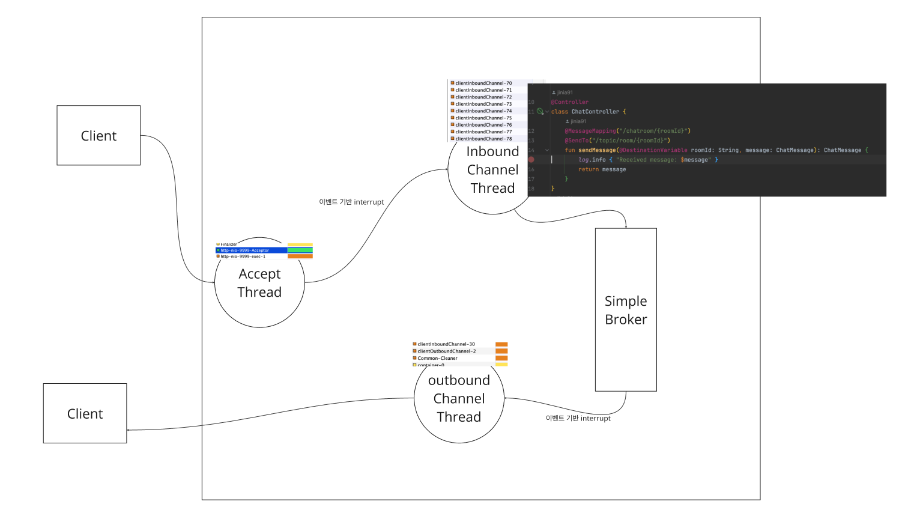
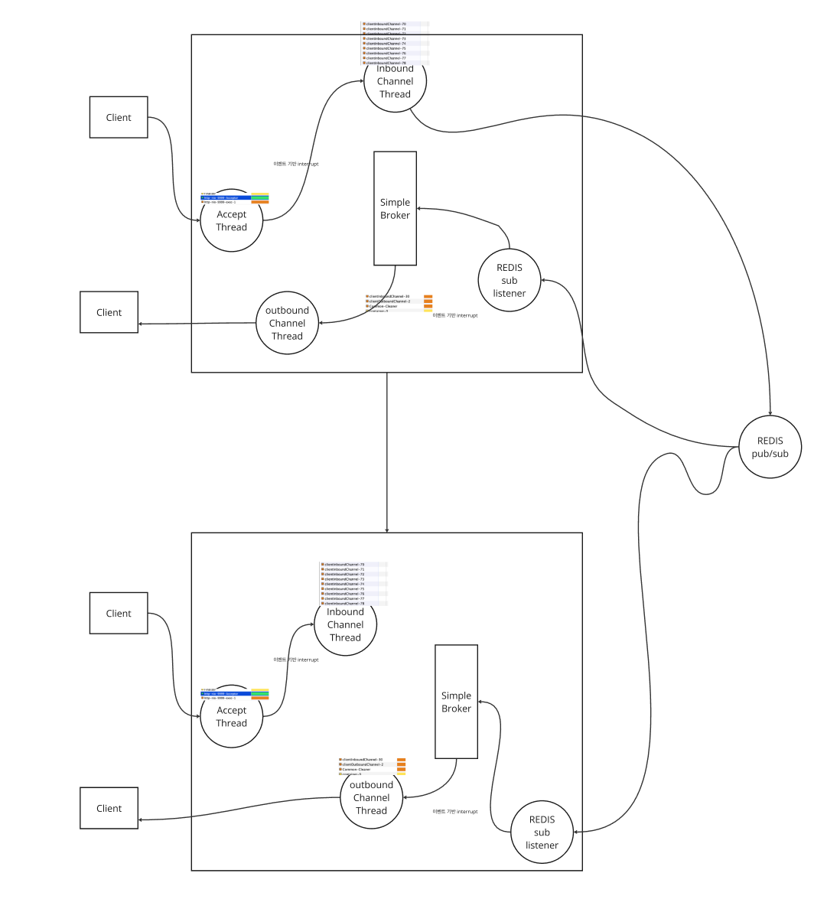

# Websocket
- RFC 6455 명세서상 정의된 프로토콜
- 서버와 브라우저간 연결을 유지한 상태로 데이터를 상호간 교환이 가능
- 이때 데이턴느 패킷형태로 전달되며 전송은 커넥션 중단과 추가 HTTP 요청 없이 양방향으로 이루어짐
- 데이터 교환이 지속적으로 이뤄져야하는 시스템에 적합

# Stomp
- 역시나 프로토콜
- https://stomp.github.io/
- 브로커 중심의 메시징 모델과, 브로커 구독 등을 모두 정의

# Spring Websocket
- websocket과 stomp 프로토콜의 java spring 구현체
- https://docs.spring.io/spring-framework/reference/web/websocket.html

현실적으로 웹소켓을 그대로 쓰는경우는 거의 없고 Stomp를 씀

카카오는 Websocket 베이스로 자체적인 프로토콜을 구축해서 프레임워크 독립적으로 사용함

## SimpleBroker
- 메모리 기반의 메시지 브로커
- Stomp에 정의된 브로커의 기능을 구현

- 인입된 메시지는 inbound channel 스레드에 의해 핸들링되다가 SimpleBroker로 넣어지고 pub
- 구독한 outbound channel thread가 꺠어나 해당 메시지를 받아서 웹소켓 세션을 통해 클라이언트로 전달
- 가장 기본적인 구조

[stomp_demo_simple_broker 프로젝트 참조](./stomp_demo_simple_broker)

## Redis Pub/Sub 동기화
- SimpleBroker는 메모리 기반의 브로커이기 때문에 서버가 재시작되면 메시지가 초기화됨
- 또한 수평 확장이 불가능함
- 이를 해결하기 위해 크게 두가지가 가능
  - 1. 브로커 자체를 외부 브로커를 사용하는 방법
  - 2. 각 서버가 브로커를 가지고 외부에서 이를 다시 동기화시키는 방법

- 위의 전송 흐름처럼 inbound Channel 은 redis로 pub을 하고 각각의 redis sub listener가 해당 메시지를 받아서 SimpleBroker로 넣어주는 구조

[stomp_demo_redis_pubsub 프로젝트 참조](./stomp_demo_redis_pubsub)
- 멀티 인스턴스로 서로 다른 포트로 실행한 뒤, 각각에 클라이언트를 붙여 실행해보면 됨
- 클라이언트

[클라이언트 파일 참조](./client.html)